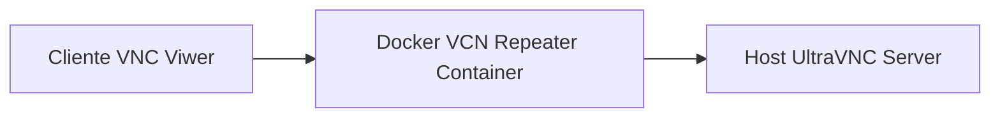
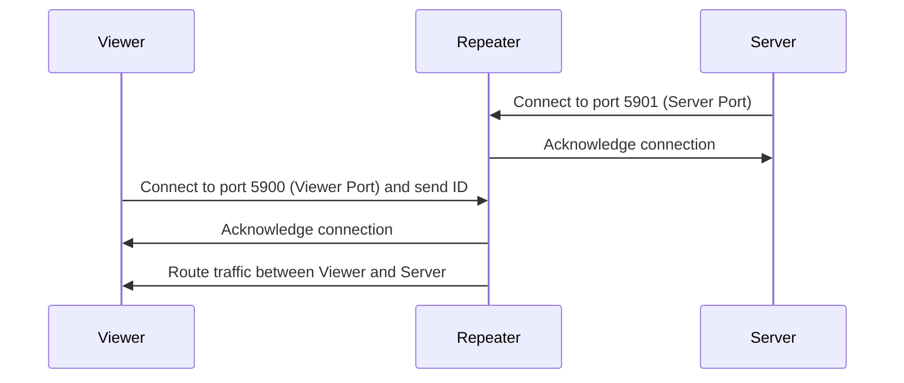

# Ultra VNC Repeater Docker
---

Building of docker image with debian linux distribution

The dockefile use the linux debian image, copy the .tar.gz to the image, compile and momves
the binary executable to a location to finally perform the execution with the user configured in the 
uvncrepeater.ini



Repeater source code to use Make C ``uvncrepeater.tar.gz``:  
[uvncrepeater](https://www.uvnc.eu/download/repeater/uvncrepeater.tar.gz)
The .taz.gz also is storaged here in the repository for copy to the image

Running the container and configure the listening ports:
```bash
docker run --rm -p 5900:5900 -p 5901:5901 uvnc-repeater
```

> [!WARNING]
> Confirm the correct port configuration in the uvncrepeater.ini file
> the default configuration is 5900 for viewer and 5901 for server, if you want to change the ports, 
> update the ini file and rebuild the image.

Running the repeater with diferent ports for testing

`port host : port container`

```bash
docker run --rm -p 5902:5900 -p 5903:5901 uvnc-repeater
```
### To run interactive and inspect the container

This enters to the container shell, using the -it flag (interactive + terminal)
and overrides the start command with bash:  
By this way, we enter to the container and is possible to perform tests and validate
direcotries and files in the file system.

> [!NOTE]
> This is isefuel when container was started with -d flag to run in background, if you want to run in  > foreground, just execute bash command in the container terminal and not override the start command with > bash.
```bash
docker run --rm -it debug-repeater /bin/bash
```

### Explanation of the ports used in the repeater



### Steps of installation

> [!NOTE]
> Is assumed Docker / Docker Desktop is installed in the system

1. Clone the repository in your local machine
2. Execute docker run
```bash
docker run --rm -p 5900:5900 -p 5901:5901 uvnc-repeater
```
> [!TIP]
> The previous command ommits -d flag to run the container in foreground, this is useful for testing
> and validate the logs of the repeater, if you want to run in background add -d flag.

### UltraVNC Service Clean Re-registration

Possible issue: The UltraVNC server installed in the remote host is configured to perform a reverse connection to a vnc repeater
usually using the port ``5900`` to perform server connection, also is configured a keepalive timing to persist the connection
and allow to the repeater mantain the route to the remote host by its configured ID.

Is possible if changes performed to the ``service_commandline`` config in the ``ultravnc.ini`` file not take effect only by restaring 
the service in the services windows tool, is necessary to uninstall the service, modify the content or update to a correct ini file and at the final install the service

### Utils commands for powershell stop services Windows

Find the process id for the uvnc server PID service
```powershell
Get-Process | Where-Object {$_.Path -like "*uvnc*"}
```

kill the process
```powershell
taskkill /PID <PID> /F /T
```

## Setup and configure the host for testing

1. Install in the target host the UltraVNC server, configure the repeater connection with the correct IP and port, also configure the keepalive timing to mantain the connection with the repeater

Config the ip of the repeater and the port for the reverse connection in the ``ultravnc.ini`` file, example:
> [!NOTE]
> In the repo is possible to use the ``ultravnc_example.ini``

```ini
service_commandline=-id:1001 -autoreconnect ID:1001 -connect <IP_Repeater>:5901
```

This should be enough to get done the configuration in the host to connect to ins trough the repeater, also is possible to configure the repeater connection with a different port, but this should be reflected in the ``ultravnc.ini`` file.